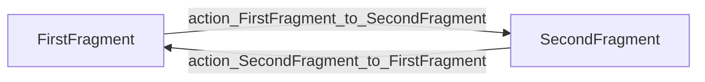

VetyCare uses the **Android Navigation Component** to handle all in-app navigation. This modern approach provides type-safe navigation, automatic back stack management, and deep linking support.

## Navigation Architecture

The navigation system consists of three main components:

<CardGroup cols={3}>
  <Card title="Navigation Graph" icon="diagram-project">
    XML file defining all destinations and navigation actions
  </Card>
  <Card title="NavHostFragment" icon="window-restore">
    Container that displays navigation destinations
  </Card>
  <Card title="NavController" icon="gamepad">
    Object that manages navigation between destinations
  </Card>
</CardGroup>

## Navigation Graph

The navigation graph is defined in `res/navigation/nav_graph.xml` and serves as the single source of truth for all navigation routes:

```xml
<?xml version="1.0" encoding="utf-8"?>
<navigation xmlns:android="http://schemas.android.com/apk/res/android"
    xmlns:app="http://schemas.android.com/apk/res-auto"
    xmlns:tools="http://schemas.android.com/tools"
    android:id="@+id/nav_graph"
    app:startDestination="@id/FirstFragment">
    
    <fragment
        android:id="@+id/FirstFragment"
        android:name="com.example.vetycare.FirstFragment"
        android:label="@string/first_fragment_label"
        tools:layout="@layout/fragment_first">
        
        <action
            android:id="@+id/action_FirstFragment_to_SecondFragment"
            app:destination="@id/SecondFragment" />
    </fragment>
    
    <fragment
        android:id="@+id/SecondFragment"
        android:name="com.example.vetycare.SecondFragment"
        android:label="@string/second_fragment_label"
        tools:layout="@layout/fragment_second">
        
        <action
            android:id="@+id/action_SecondFragment_to_FirstFragment"
            app:destination="@id/FirstFragment" />
    </fragment>
</navigation>
```

### Graph Structure Breakdown

<AccordionGroup>
  <Accordion title="Start Destination">
    ```xml
    app:startDestination="@id/FirstFragment"
    ```
    
    Defines which fragment is displayed when the app launches. In VetyCare, **FirstFragment** is the initial destination.
  </Accordion>
  
  <Accordion title="Fragment Destinations">
    Each `<fragment>` element represents a screen in the app:
    
    ```xml
    <fragment
        android:id="@+id/FirstFragment"
        android:name="com.example.vetycare.FirstFragment"
        android:label="@string/first_fragment_label"
        tools:layout="@layout/fragment_first">
    ```
    
    - **android:id**: Unique identifier for the destination
    - **android:name**: Fully qualified class name
    - **android:label**: Display name (shown in toolbar)
    - **tools:layout**: Layout preview in Android Studio
  </Accordion>
  
  <Accordion title="Navigation Actions">
    Each `<action>` defines a possible navigation route:
    
    ```xml
    <action
        android:id="@+id/action_FirstFragment_to_SecondFragment"
        app:destination="@id/SecondFragment" />
    ```
    
    Actions are referenced in code to navigate between screens.
  </Accordion>
</AccordionGroup>

## Navigation Flow

VetyCare has a bidirectional navigation flow between two fragments:



<Note>
  The navigation graph creates a circular navigation pattern where users can move freely between FirstFragment and SecondFragment.
</Note>

## NavController Setup in MainActivity

The **MainActivity** is responsible for setting up the navigation controller and integrating it with the app bar.

From `MainActivity.kt:19-29`:

```kotlin
class MainActivity : AppCompatActivity() {
    
    private lateinit var appBarConfiguration: AppBarConfiguration
    private lateinit var binding: ActivityMainBinding
    
    override fun onCreate(savedInstanceState: Bundle?) {
        super.onCreate(savedInstanceState)
        
        binding = ActivityMainBinding.inflate(layoutInflater)
        setContentView(binding.root)
        
        setSupportActionBar(binding.toolbar)
        
        val navController = findNavController(R.id.nav_host_fragment_content_main)
        appBarConfiguration = AppBarConfiguration(navController.graph)
        setupActionBarWithNavController(navController, appBarConfiguration)
    }
}
```

### Setup Steps Explained

<Steps>
  <Step title="Find NavController">
    Retrieve the NavController from the NavHostFragment:
    
    ```kotlin
    val navController = findNavController(R.id.nav_host_fragment_content_main)
    ```
    
    The `findNavController()` method locates the NavController associated with the NavHostFragment defined in the layout.
  </Step>
  
  <Step title="Configure AppBar">
    Create an AppBarConfiguration with the navigation graph:
    
    ```kotlin
    appBarConfiguration = AppBarConfiguration(navController.graph)
    ```
    
    AppBarConfiguration determines when the Up button should be displayed in the toolbar. By passing the navigation graph, the Up button appears on all destinations except the start destination.
  </Step>
  
  <Step title="Setup Action Bar">
    Connect the ActionBar with the NavController:
    
    ```kotlin
    setupActionBarWithNavController(navController, appBarConfiguration)
    ```
    
    This method automatically updates the toolbar title based on the current destination's label and handles the Up button display.
  </Step>
</Steps>

### Handling Up Navigation

The MainActivity overrides `onSupportNavigateUp()` to handle the Up button press:

From `MainActivity.kt:54-58`:

```kotlin
override fun onSupportNavigateUp(): Boolean {
    val navController = findNavController(R.id.nav_host_fragment_content_main)
    return navController.navigateUp(appBarConfiguration)
            || super.onSupportNavigateUp()
}
```

<Tip>
  This implementation delegates Up navigation to the NavController, which automatically pops the back stack. If the NavController can't handle the navigation (e.g., at the start destination), it falls back to the default behavior.
</Tip>

## Navigation in Fragments

### FirstFragment Navigation

FirstFragment navigates to SecondFragment when the button is clicked.

From `FirstFragment.kt:32-38`:

```kotlin
class FirstFragment : Fragment() {
    
    private var _binding: FragmentFirstBinding? = null
    private val binding get() = _binding!!
    
    override fun onViewCreated(view: View, savedInstanceState: Bundle?) {
        super.onViewCreated(view, savedInstanceState)
        
        binding.buttonFirst.setOnClickListener {
            findNavController().navigate(R.id.action_FirstFragment_to_SecondFragment)
        }
    }
}
```

**Navigation Breakdown:**

1. **Find NavController**: `findNavController()` retrieves the NavController from the fragment
2. **Navigate**: `navigate(R.id.action_FirstFragment_to_SecondFragment)` executes the navigation action
3. **Type Safety**: The action ID is generated from the navigation graph, ensuring compile-time safety

### SecondFragment Navigation

SecondFragment navigates back to FirstFragment in a similar manner.

From `SecondFragment.kt:32-38`:

```kotlin
class SecondFragment : Fragment() {
    
    private var _binding: FragmentSecondBinding? = null
    private val binding get() = _binding!!
    
    override fun onViewCreated(view: View, savedInstanceState: Bundle?) {
        super.onViewCreated(view, savedInstanceState)
        
        binding.buttonSecond.setOnClickListener {
            findNavController().navigate(R.id.action_SecondFragment_to_FirstFragment)
        }
    }
}
```

## NavHostFragment Layout

The NavHostFragment is defined in the content layout and serves as the container for fragment destinations.

From `res/layout/content_main.xml` (inferred structure):

```xml
<androidx.fragment.app.FragmentContainerView
    android:id="@+id/nav_host_fragment_content_main"
    android:name="androidx.navigation.fragment.NavHostFragment"
    android:layout_width="match_parent"
    android:layout_height="match_parent"
    app:defaultNavHost="true"
    app:navGraph="@navigation/nav_graph" />
```

**Key Attributes:**

| Attribute | Value | Purpose |
|-----------|-------|----------|
| **android:name** | `androidx.navigation.fragment.NavHostFragment` | Specifies this is a NavHostFragment |
| **app:defaultNavHost** | `true` | Intercepts system Back button |
| **app:navGraph** | `@navigation/nav_graph` | Links to the navigation graph |

<Warning>
  Setting `app:defaultNavHost="true"` is crucial for proper back stack handling. Without it, the system Back button won't work correctly with the Navigation Component.
</Warning>

## Navigation Methods

The Navigation Component provides several methods for navigating:

<Tabs>
  <Tab title="Navigate by Action">
    **Recommended approach** - Uses action IDs from the navigation graph:
    
    ```kotlin
    findNavController().navigate(R.id.action_FirstFragment_to_SecondFragment)
    ```
    
    **Benefits:**
    - Type-safe
    - Defined in navigation graph
    - Can include animations and pop behavior
  </Tab>
  
  <Tab title="Navigate by Destination">
    Navigate directly to a destination ID:
    
    ```kotlin
    findNavController().navigate(R.id.SecondFragment)
    ```
    
    **Use when:**
    - No action is defined in the graph
    - You want to navigate from anywhere
  </Tab>
  
  <Tab title="Navigate Up">
    Navigate to the previous destination:
    
    ```kotlin
    findNavController().navigateUp()
    ```
    
    **Equivalent to:**
    - Pressing the Up button
    - Pressing the Back button
  </Tab>
  
  <Tab title="Pop Back Stack">
    Manually pop the back stack:
    
    ```kotlin
    findNavController().popBackStack()
    ```
    
    **Use when:**
    - Custom back stack manipulation
    - Closing a screen programmatically
  </Tab>
</Tabs>

## Navigation Best Practices

<AccordionGroup>
  <Accordion title="Always Use findNavController()">
    Access the NavController through `findNavController()` rather than maintaining references:
    
    ```kotlin
    // ✅ Good
    binding.button.setOnClickListener {
        findNavController().navigate(R.id.action_to_destination)
    }
    
    // ❌ Bad - Don't cache NavController
    private lateinit var navController: NavController
    
    override fun onViewCreated(view: View, savedInstanceState: Bundle?) {
        navController = findNavController() // Can cause issues
    }
    ```
  </Accordion>
  
  <Accordion title="Define Navigation Actions in Graph">
    Always define actions in the navigation graph rather than navigating directly to destinations:
    
    ```xml
    <!-- ✅ Good - Explicit action -->
    <action
        android:id="@+id/action_FirstFragment_to_SecondFragment"
        app:destination="@id/SecondFragment"
        app:enterAnim="@anim/slide_in_right"
        app:exitAnim="@anim/slide_out_left" />
    ```
    
    ```kotlin
    // ✅ Good - Navigate with action
    findNavController().navigate(R.id.action_FirstFragment_to_SecondFragment)
    
    // ⚠️ Less preferred - Direct destination navigation
    findNavController().navigate(R.id.SecondFragment)
    ```
  </Accordion>
  
  <Accordion title="Handle Navigation in onViewCreated()">
    Set up click listeners that trigger navigation in `onViewCreated()`, not in `onCreateView()`:
    
    ```kotlin
    override fun onViewCreated(view: View, savedInstanceState: Bundle?) {
        super.onViewCreated(view, savedInstanceState)
        
        binding.button.setOnClickListener {
            findNavController().navigate(R.id.action_to_destination)
        }
    }
    ```
  </Accordion>
  
  <Accordion title="Check NavController Availability">
    When navigating from lifecycle-aware methods, check if the NavController is available:
    
    ```kotlin
    try {
        findNavController().navigate(R.id.action_to_destination)
    } catch (e: IllegalStateException) {
        // Fragment not attached to NavController
        Log.e(TAG, "Navigation failed", e)
    }
    ```
  </Accordion>
</AccordionGroup>

## Navigation and Toolbar Integration

VetyCare's navigation is tightly integrated with the Material Toolbar:

<Steps>
  <Step title="Toolbar Updates Automatically">
    When navigating between fragments, the toolbar title automatically updates based on the `android:label` attribute in the navigation graph:
    
    ```xml
    <fragment
        android:id="@+id/FirstFragment"
        android:label="@string/first_fragment_label"
        ... />
    ```
  </Step>
  
  <Step title="Up Button Display">
    The Up button automatically appears on non-start destinations:
    
    - **FirstFragment**: No Up button (start destination)
    - **SecondFragment**: Up button displayed
  </Step>
  
  <Step title="Custom Toolbar Behavior">
    To customize which destinations show the Up button, modify the AppBarConfiguration:
    
    ```kotlin
    // Multiple top-level destinations (no Up button)
    appBarConfiguration = AppBarConfiguration(
        setOf(R.id.FirstFragment, R.id.SecondFragment)
    )
    ```
  </Step>
</Steps>

## Navigation States and Back Stack

The Navigation Component manages the back stack automatically:

### Current Navigation Pattern

```
User Action: Launch App
Back Stack: [FirstFragment]

User Action: Click button in FirstFragment
Back Stack: [FirstFragment, SecondFragment]

User Action: Press Back or Up
Back Stack: [FirstFragment]

User Action: Press Back again
Result: App exits
```

### Back Stack Visualization

<CodeGroup>
```text Initial State
┌─────────────────┐
│ FirstFragment   │ ← Current
└─────────────────┘
```

```text After Navigation
┌─────────────────┐
│ SecondFragment  │ ← Current
├─────────────────┤
│ FirstFragment   │
└─────────────────┘
```

```text After Back Press
┌─────────────────┐
│ FirstFragment   │ ← Current
└─────────────────┘
```
</CodeGroup>

## Advanced Navigation Patterns

While VetyCare currently uses simple navigation, here are patterns you might add:

<CardGroup cols={2}>
  <Card title="Passing Arguments" icon="arrow-right-arrow-left">
    Use Safe Args plugin to pass data between fragments:
    ```kotlin
    val action = FirstFragmentDirections
        .actionFirstToSecond(userId = 123)
    findNavController().navigate(action)
    ```
  </Card>
  
  <Card title="Deep Links" icon="link">
    Handle navigation from external intents:
    ```xml
    <fragment android:id="@+id/Fragment">
        <deepLink
            app:uri="vetycare://detail/{id}" />
    </fragment>
    ```
  </Card>
  
  <Card title="Nested Graphs" icon="diagram-nested">
    Organize related destinations:
    ```xml
    <navigation android:id="@+id/auth_graph">
        <fragment android:id="@+id/LoginFragment" />
        <fragment android:id="@+id/RegisterFragment" />
    </navigation>
    ```
  </Card>
  
  <Card title="Conditional Navigation" icon="code-branch">
    Navigate based on conditions:
    ```kotlin
    val destination = if (isLoggedIn) {
        R.id.action_to_home
    } else {
        R.id.action_to_login
    }
    findNavController().navigate(destination)
    ```
  </Card>
</CardGroup>

## Navigation Testing

Test navigation using the Navigation Testing library:

```kotlin
@Test
fun testNavigationFromFirstToSecond() {
    val navController = TestNavHostController(ApplicationProvider.getApplicationContext())
    
    launchFragmentInContainer<FirstFragment> {
        navController.setGraph(R.navigation.nav_graph)
        Navigation.setViewNavController(requireView(), navController)
    }
    
    onView(withId(R.id.button_first)).perform(click())
    
    assertEquals(R.id.SecondFragment, navController.currentDestination?.id)
}
```

## Common Navigation Issues

<Warning>
  **Issue**: "IllegalStateException: Fragment not associated with NavController"
  
  **Solution**: Ensure you're calling `findNavController()` after the fragment's view is created (in or after `onViewCreated()`).
</Warning>

<Warning>
  **Issue**: Navigation not working when using `navigate()` multiple times quickly
  
  **Solution**: Check if already navigating before calling `navigate()` again, or use `navigateSafe()` extension.
</Warning>

## Summary

VetyCare's navigation architecture provides:

- **Type-safe navigation** with generated action IDs
- **Automatic back stack management** by the Navigation Component
- **Toolbar integration** with automatic title and Up button handling
- **Single Activity architecture** reducing memory overhead
- **Clear navigation graph** defining all app routes in one place

## Next Steps

<CardGroup cols={2}>
  <Card title="Architecture Overview" icon="sitemap" href="/architecture/overview">
    Learn about VetyCare's overall architecture
  </Card>
  <Card title="Project Structure" icon="folder-tree" href="/architecture/project-structure">
    Explore the project's directory organization
  </Card>
</CardGroup>